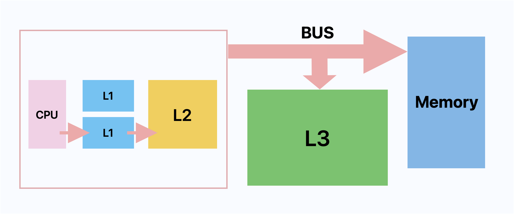

## 날짜: 2025-02-05

## 딥다이브

### 오늘의 주제 : 캐시 메모리와 성능

 

### 🤔 캐시 메모리란

#### 캐시메모리의 역할
캐시 메모리는 CPU가 자주 접근하는 데이터를 임시로 저장해 메모리 접근 속도를 향상 시키는 역할을 한다.

#### 무엇을 저장할지 예측하는 방법
- 시간 지역성 : 최근에 접근한 데이터는 다시 접근될 가능성이 높음
- 공간 지역성 : 인접한 메모리 주소의 데이터도 함께 접근될 가능성이 높음

 

### 👉 캐시 메모리와 CPU 성능의 상관관계

#### 💡 만약 캐시 메모리가 없다면
CPU가 필요한 데이터를 메인 메모리에서 직접 가져와야 한다.
근데 메모리 접근 속도가 CPU 연산 속도 보다 느려 성능 저하가 발생한다.
- 메모리 병목 현상 : CPU는 빠른 속도로 연산을 수행하지만 메모리 접근 속도가 연산 속도를 따라가지 못하면 연산 대기 시간이 증가함
- 명령어 실행 지연 : 실행해야 할 명령어와 데이터를 불러오는 데 시간이 오래 걸리기 때문에 프로그램 실행 속도가 느려짐
- 전력 소모 증가 : 메모리에 직접 접근이 많아질 수록 더 많은 전력이 소모됨

#### 💡 캐시 메모리를 사용하면?
- CPU 연산 속도와 메모리 접근 속도 차이 줄어듦
- 자주 사용하는 데이터를 캐시 메모리에 저장하기 때문에 메모리 접근을 줄여 효율적으로 사용할 수 있음
- 프로그램 실행 속도가 빨라짐

 

### 👉 L1, L2, L3 역할
캐시 메모리는 계층 구조를 가지고 있으며 각 계층마다 역할이 다르다.

#### 1️⃣ L1 캐시
- 셋 중 크기가 가장 작고 속도가 빠름
- CPU가 가장 먼저 데이터를 찾는 곳
- 명령어 저장 캐시인 L1I와 데이터 저장 캐시인 L1D로 나뉠 수 있음 (접근 속도를 빠르게 하기 위함)
- 멀티 코어 프로세서의 경우 각 코어마다 할당됨

#### 2️⃣ L2 캐시
- L1 보다 용량이 크지만 상대적으로 느림
- CPU가 L1에서 찾지 못한 데이터는 L2에서 찾음
- 멀티 코어 프로세서의 경우 각 코어마다 할당됨

#### 3️⃣ L3 캐시
- 멀티 코어 프로세서의 경우 여러 코어가 공유
- L1, L2 보다 용량은 크지만 속도는 느림

 

#### 👉 각 계층의 차이 정리

#### CPU가 접근하는 순서
- L1 → L2 → L3
#### 메모리 용량
- L1 < L2 < L3
#### 속도
- L3 < L2 < L1

 

### 👉 L1, L2, L3가 프로그램 성능에 미치는 영향

#### 1️⃣ L1 캐시
- CPU에서 가장 자주 접근하는 데이터와 명령어를 저장해서 연산 속도를 높임
- 캐시 미스가 발생하면 L2 캐시를 조회해야 함

#### 2️⃣ L2 캐시
- L1 캐시에서 저장하지 못한 데이터를 저장해 CPU가 메인 메모리까지 접근하는 횟수를 줄임
- L1 캐시 보다 용량이 크지만 속도가 느림
- L2 캐시 크기가 크면 프로그램 성능이 향상됨

#### 3️⃣ L3 캐시
- 여러 코어가 데이터를 공유할 수 있어 멀티 스레드의 성능 향상됨

 

### 오늘의 회고
- L1, L2, L3의 역할에 대해 자세히 알아보고 싶었는데 생각 보다 자료를 찾기가 쉽지 않았다. 
- 기존에 공부한 내용을 다시 한 번 머릿속에 정리할 수 있어서 좋았다. 

 

#### 참고

- https://velog.io/@33bini/%EC%BA%90%EC%8B%9C-%EB%A9%94%EB%AA%A8%EB%A6%ACCache-Memory
- https://en.wikipedia.org/wiki/CPU_cache