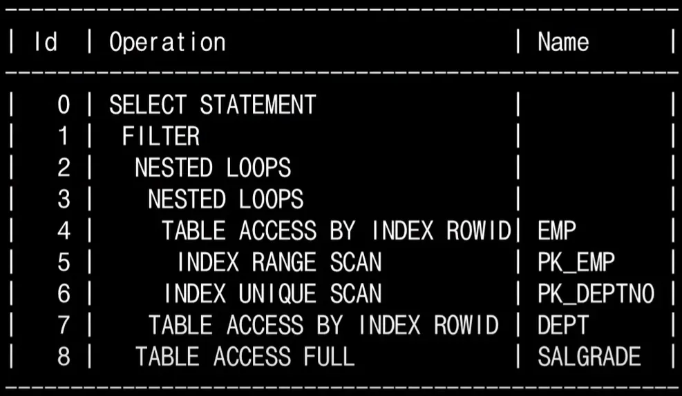

## 날짜: 2024-11-20

## [딥다이브] EXPLAIN, ANALYZE 쿼리

### 실행 계획이란?

> 실행 계획은 **DBMS 옵티마이저가 SQL 쿼리를 실행하기 위해 설정한 최적의 실행 순서와 방식**임 동일한 쿼리여도 데이터베이스의 상태와 통계 정보에 따라 효율적인 실행 경로가 달라질 수 있으며, 옵티마이저는 여러 전략 중 가장 적절한 방법을 찾아 실행 계획을 세움

### 실행 계획 해석하는 방법

> 실행 계획은 여러 단계로 나뉘며 이를 `step`이라고 함 각 `step`은 해당 단계에서 어떤 명령이 수행되었고, 총 몇 건의 데이터가 처리되었는지, 그리고 이 처리를 위해 얼만큼의 비용 및 시간이 소요되었는지를 표시함

### 실행 계획 순서 읽는 방법

1. 위에서 아래로 읽어 내려가면서 제일 먼저 읽을 `step`을 찾는다.
2. 내려가는 과정에서 같은 들여쓰기가 존재하면 무조건 위 → 아래 순으로 읽는다. 
3. 읽고자 하는 `step`보다 들여쓰기 된 하위 스텝이 존재하면 가장 안쪽으로 들여쓰기 된 `step`을 시작으로 한 단계씩 상위 `step`으로 읽어 나온다.



### 실행 계획 예시

> 예시의 실행 순서: 5 → 4 → 6 → 3 → 7 → 2 → 8 → 1 → 0

---

### 실행 계획 생성

> `EXPLAIN` 명령어를 사용해서 SQL 쿼리의 실행 계획을 생성할 수 있음

```sql
EXPLAIN PLAN
SET STATEMENT_ID = '계획명' INTO PLAN_TABLE
FOR SQL_쿼리;
```

- `SET STATEMENT_ID`: 실행 계획의 이름을 지정하는 옵션
- `INTO PLAN_TABLE`: 실행 계획을 저장할 테이블 지정 (미리 생성돼 있는 테이블이어야 함)

### EXPLAIN 사용 목적

- 설계한 쿼리가 의도한 방식으로 동작하는지 점검
- 예상되는 성능 병목을 사전에 확인

### EXPLAIN 사용 시 주의할 점

> `EXPLAIN`은 실제 실행 결과를 다루지 않고 실행 전 ***예측에 기반***함 따라서 항상 최적의 실행 계획을 보장하지 않기 때문에 실제 실행 전략이 다를 수 있음

---

### EXPLAIN ANALYZE

> `ANALYZE`는 `EXPLAIN` 명령어와 함께 쓰이는 옵션으로 쿼리 실행 중 MySQL이 어디서 시간을 많이 썼는지 그 이유가 무엇인지 ***분석***할 수 있음 쿼리문을 ***실제로 실행***하고 실행된 시간 및 통계를 표시하며 성능 튜닝에 필수적

### EXPLAIN ANALYZE 사용 목적

- 쿼리 실행 시 발생하는 실제 성능 병목 파악
- 예상 실행 계획과 실제 실행이 어떻게 다른지 확인

### 사용 예시

> 쿼리를 실제 실행하여 단계별 소요 시간, 처리된 데이터 건수를 보여줌 분석할 쿼리 앞에 `EXPLAIN ANALYZE` 키워드를 붙이고 실행

```sql
EXPLAIN ANALYZE
SELECT first_name, last_name, SUM(amount) AS total
FROM staff INNER JOIN payment
  ON staff.staff_id = payment.staff_id
     AND
     payment_date LIKE '2005-08%'
GROUP BY first_name, last_name;
```

### 쿼리 실행 분석법

`EXPLAIN` 결과

```sql
-> Table scan on <temporary>
    -> Aggregate using temporary table
        -> Nested loop inner join  (cost=1757.30 rows=1787)
            -> Table scan on staff  (cost=3.20 rows=2)
            -> Filter: (payment.payment_date like '2005-08%')  (cost=117.43 rows=894)
                -> Index lookup on payment using idx_fk_staff_id (staff_id=staff.staff_id)  (cost=117.43 rows=8043)
```

`EXPLAIN ANALYZE` 결과

```sql
-> Table scan on <temporary>  (actual time=0.001..0.001 rows=2 loops=1)
    -> Aggregate using temporary table  (actual time=58.104..58.104 rows=2 loops=1)
        -> Nested loop inner join  (cost=1757.30 rows=1787) (actual time=0.816..46.135 rows=5687 loops=1)
            -> Table scan on staff  (cost=3.20 rows=2) (actual time=0.047..0.051 rows=2 loops=1)
            -> Filter: (payment.payment_date like '2005-08%')  (cost=117.43 rows=894) (actual time=0.464..22.767 rows=2844 loops=2)
                -> Index lookup on payment using idx_fk_staff_id (staff_id=staff.staff_id)  (cost=117.43 rows=8043) (actual time=0.450..19.988 rows=8024 loops=2)
```

| 용어 | 의미 |
| --- | --- |
| 들여쓰기 | 같은 레벨: 상단에 위치한 것을 먼저 실행, 다른 레벨: 안쪽에 위치한 것을 먼저 실행 |
| actual | 실행 결과 |
| time | 실행 시간(ms) |
| time=a…b 중 a | 첫 번째 행을 읽어오는데 들었던 시간의 평균(ms) |
| time=a…b 중 b | 모든 행을 읽어오는데 들었던 시간의 평균(ms) |
| rows | 반환된 행수의 평균 |
| loops | 작업을 반복한 횟수 |
| cost | CPU 사이클, I/O 접근 빈도 등 리소스 소모에 대한 추정치 |

### 트러블 슈팅 접근 방법

1. 쿼리가 느릴 때: time이 가장 큰 부분 찾기
2. 실행 시 사용된 전략이 합리적이지 못할 때
    - rows가 실행 계획과 크게 차이나는 부분이 있는지 확인
    - 실행 계획 상의 rows로 전략을 세우기 때문에 차이가 많이 난다면 전략이 비합리적인 것이 원인일 수 있음

### EXPLAIN 사용 이유

> `EXPLAIN ANALYZE`는 실제 실행 결과가 나와야 하기 때문에 느린 쿼리 또는 부하가 큰 쿼리를 분석할 때 부담이 될 수 있음 이러한 경우 실행하지 않아도 전략을 예측할 수 있는 `EXPLAIN`이 더 유용할 수 있음

---

### 오늘의 회고
- [스터디]
  - 오늘은 자료구조 스터디 첫 날이었다. 8시에 모여 10시 30분이 넘어서야 마무리 됐다. 정해진 저료구조에 대해 각자 조사 및 내용을 정리하여 git에 push한 뒤 내용을 정리하여 하나의 문서로 만드는 방식으로 진행하였다. 진행 방식에 대해 이야기할 땐 괜찮은 방법이라고 생각했는데 막상 해보니 예상보다 시간이 훨씬 많이 소모되어 더 나은 방안에 대해 얘기해 볼 예정이다. 

- [딥다이브]
  - 오늘 딥다이브 주제는 EXPLAIN, ANALYZE 쿼리였다. 공부를 할 수록 어려운 내용이 많이 나왔는데 10분 안에 전부 이해할 수 있게끔 설명하는 것이 어려워보여 덜어낸 내용이 많았다. 
  다른 사람에게 이해가 가도록 설명해야 하기 때문에 어떻게 하면 쉽게 설명할 수 있을지 고민하는 과정에서 꺠달음을 얻게 되는 신기한 경험을 하였다. 오늘 딥다이브 주제가 전체적으로 좋았기 때문에 
  주말에 시간을 내어 다른 주제에 대해서도 공부를 할 예정이다. 

### 참고
- [Coding Factory](https://coding-factory.tistory.com/744)
- [Velog: MySQL 슬로우쿼리 잡는 명령어 EXPLAIN ANALYZE 해석법](https://velog.io/@wisepine/MySQL-%EC%8A%AC%EB%A1%9C%EC%9A%B0%EC%BF%BC%EB%A6%AC-%EC%9E%A1%EB%8A%94-%EB%AA%85%EB%A0%B9%EC%96%B4-EXPLAIN-ANALIZE-%ED%95%B4%EC%84%9D%EB%B2%95)
